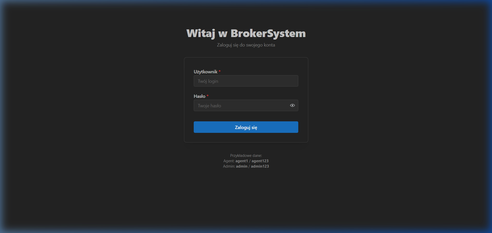
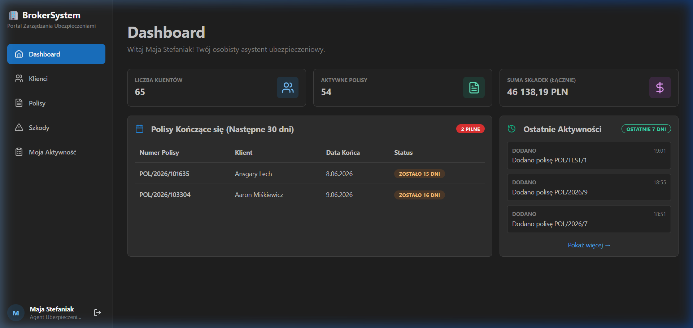
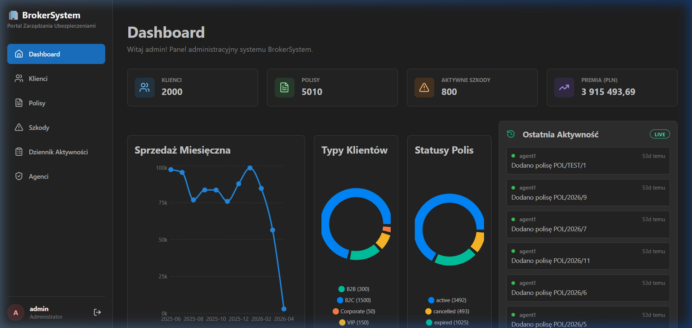
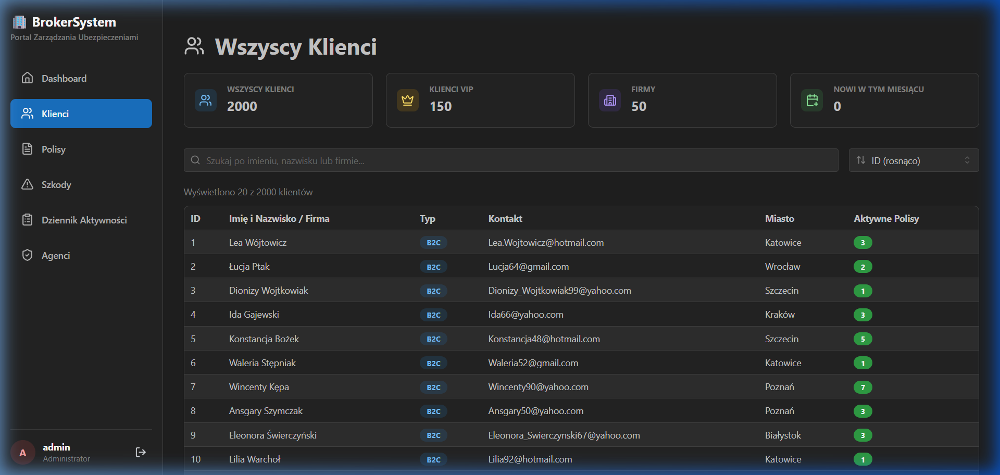
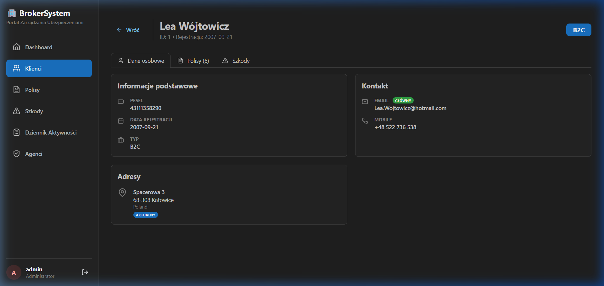
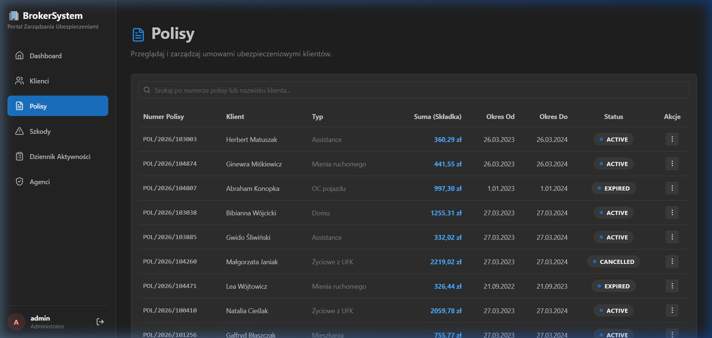
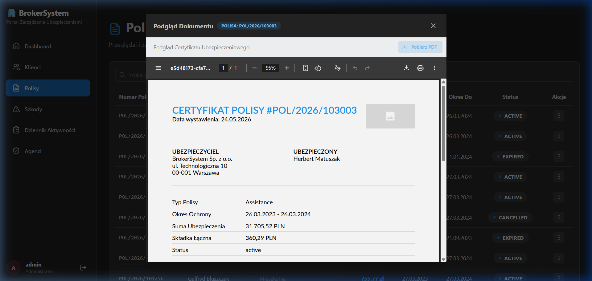
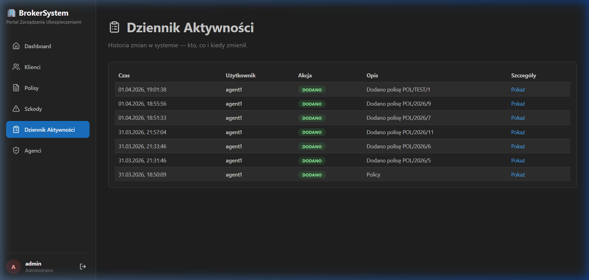
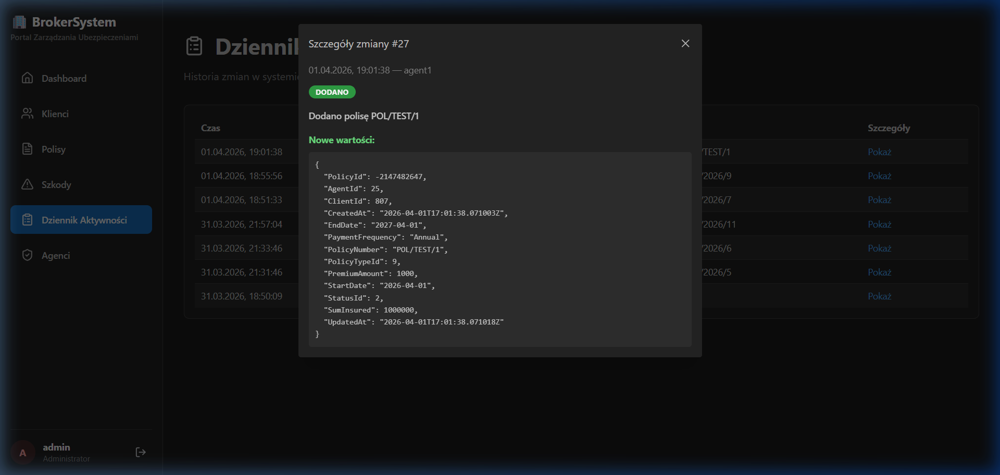

# 🛡️ BrokerSystem

Nowoczesny i wydajny system typu **Modular Monolith** do zarządzania agencją ubezpieczeniową. Projekt łączy w sobie czystą architekturę, wysoką wydajność (Dapper) oraz interfejs użytkownika zrealizowany w React + Mantine.

---

## 📸 Preview (System w akcji)

### 1. Ekran Logowania
Profesjonalny, bezpieczny dostęp do systemu z podziałem na role (**Agent** / **Admin**). Panel automatycznie autoryzuje i kieruje użytkownika do odpowiedniego panelu roboczego.


### 2. Dashboard Agenta (Personal Assistant)
Dedykowany pulpit dla agenta ubezpieczeniowego skupiający się na zadaniach operacyjnych. Zawiera listę najbliższych odnowień polis (w ciągu 30 dni) z oznaczeniem pilności oraz wgląd w ostatnie aktywności.

> [!TIP]
> **Widok Agenta**: Ułatwia codzienną pracę operacyjną ("Co muszę zrobić dzisiaj?"). Widgety pokazują osobistą sumę składek oraz liczbę obsługiwanych klientów i aktywnych polis.

### 3. Dashboard Admina (Agency Overview)
Centrum dowodzenia menedżera lub administratora agencji. Udostępnia globalne statystyki sprzedaży (miesięczne sumy składek w formie wykresu liniowego), podział klientów na typy (B2B, B2C, Corporate, VIP) oraz statusy posiadanych polis. Dodatkowo integruje **Live Activity Feed** zasilany przez SignalR.


### 4. Lista Klientów (Client Registry)
Przejrzysta lista wszystkich ubezpieczonych w systemie wraz z podsumowaniami liczbowymi. Umożliwia dynamiczne wyszukiwanie oraz sortowanie klientów.


### 5. Widok Klienta 360° (Detailed Profile)
Kompleksowy widok profilu klienta zawierający podstawowe informacje (PESEL, data rejestracji), dane kontaktowe, aktualny adres oraz powiązane z nim polisy i szkody.


### 6. Ewidencja Polis (Policies Dashboard)
Centralny rejestr umów ubezpieczeniowych w agencji z informacjami o składkach, okresie ochrony oraz statusie polisy (Active, Expired, Cancelled).


### 7. Podgląd Certyfikatu Ubezpieczeniowego PDF
Wbudowany podgląd generowanego dynamicznie przez silnik **QuestPDF** certyfikatu polisy ubezpieczeniowej z opcją bezpośredniego pobrania pliku PDF na dysk.

> [!NOTE]
> System w locie kompiluje dane polisy, generując profesjonalny dokument gotowy do wydruku lub wysyłki klientowi.

### 8. Dziennik Aktywności (Security & Audit Trail)
Kompletna historia modyfikacji danych w systemie (kto, kiedy i jaką akcję wykonał). Zapewnia pełną transparentność i spełnia wymogi bezpieczeństwa/audytu.


### 9. Szczegóły Zmiany (Audit Payload)
Każdy wpis w dzienniku aktywności można rozwinąć, aby zobaczyć dokładny stan obiektu (payload JSON) przed lub po modyfikacji.


---

## 🎯 Cel Projektu
BrokerSystem został stworzony, aby zautomatyzować procesy w agencjach brokerskich, zapewniając pełną kontrolę nad portfelem polis, roszczeń i prowizji przy zachowaniu najwyższych standardów bezpieczeństwa (RBAC) i wydajności.

## 🚀 Kluczowe Funkcje
*   **Smart Monolith Architecture**: Czysty podział na warstwy, w pełni oparty na architekturze Vertical Slice z podejściem REPR (Request-Endpoint-Response).
*   **Dynamic Endpoint Registration**: Brak klasycznych kontrolerów (Minimal APIs) – automatyczne rejestrowanie tras w czasie *runtime* dzięki refleksji.
*   **Dapper Integration**: Wykorzystanie "czystego SQL" dla krytycznych widoków, zapewniając czasy odpowiedzi liczony w milisekundach nawet przy tysiącach rekordów.
*   **Security & RBAC (Role-Based Access Control)**: Uwierzytelnianie oparte na JWT. Zaawansowana izolacja danych i sprawdzanie ról zarówno na poziomie definicji tras, jak i wstrzykiwane w logikę (przez `ICurrentUserService`).
*   **MediatR & Cross-Cutting Concerns**: Wzorzec CQRS rozbudowany o *Pipeline Behaviors* obsługujące automatyczną autoryzację i walidację zapytań.
*   **FluentValidation**: Automatyczna walidacja wejścia zapobiegająca błędnym danym przed dotarciem do logiki biznesowej.
*   **Global Exception Handling**: Niestandardowy middleware przechwytujący wyjątki (np. `ValidationException`) i mapujący je na bezpieczne, jednolite odpowiedzi JSON (400 Bad Request, 404 Not Found, itp.).
*   **Caching**: `ICacheService` z `IMemoryCache` optymalizujący najcięższe zapytania bazodanowe.
*   **QuestPDF Implementation**: Profesjonalne wydruki certyfikatów polis generowane w locie.
*   **Mantine UI implementation**: Responsywny, nowoczesny interfejs z pełnym wsparciem Dark Mode.

## 🛠️ Tech Stack

### Backend (.NET 8)
*   **Architecture**: Vertical Slice Architecture, Minimal APIs (REPR pattern).
*   **ORM/Data**: Entity Framework Core (write) + **Dapper** (read/performance).
*   **Service Bus/Mediator**: MediatR (Command/Query separation) with Pipeline Behaviors.
*   **Validation**: FluentValidation.
*   **Security**: JWT Bearer Authentication, Role-Based Access Control (RBAC).
*   **PDF Engine**: QuestPDF.
*   **Real-time**: SignalR.

### Frontend (React + TypeScript)
*   **State Management**: TanStack Query (React Query) - inteligentne cache'owanie danych.
*   **UI Framework**: Mantine UI (v7).
*   **Navigation**: React Router 6.

## ⚙️ Uruchomienie Projektu

1.  **Baza Danych**: System domyślnie korzysta z MSSQL (LocalDB) i automatycznie wykonuje **Smart Seeding** (5000+ rekordów).
2.  **Backend**:
    ```bash
    cd BrokerSystem.Api
    dotnet run
    ```
3.  **Frontend**:
    ```bash
    cd BrokerSystem.UI
    npm install
    npm run dev
    ```

---
*Projekt przygotowany jako showcase nowoczesnego programowania w ekosystemie .NET & React.*
